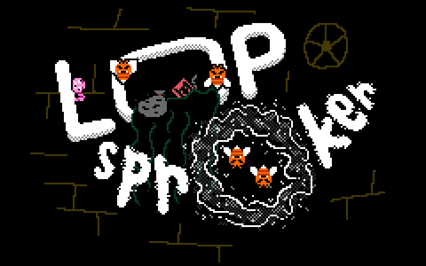

## LOOP Sproker

> [!WARNING]
> ON WEB/HTML5 VERSION: Your high score will not be saved across multiple sessions + The options in the settings menu won't change anything.

This game was made for the GMTK Game Jam 2025 under 96 hours. This is my second time participating in this game jam, or in any game jam for that matter. Last year I had a very good experience joining a game jam for the first time. Since then, I tried to work on the things I struggled with, So that I'll be able to make an improvement next time.

While making the game this year, I tried to keep the criticism and tips I received last year in mind, to hopefully help more people enjoy my game this time. To be honest, I think I did manage to improve most of what I was lacking in last year's game jam, but the idea I went with this year didn't really "click with me" like the one from last year. The idea seemed good when I described it to my self, but when I started implementing it, I realized that I'll need to add and change some mechanics to make this game into a fun and unique challenge. From my own play testing, I THINK the game ended up being fun, but I can't be sure until I hear what other people have to say.

# Switching to Godot Engine

So last year I choose to use GameMaker Studio 2 to make my game, but I just picked it up after a long time of not using it and because of that I struggled with learning how to use the features of the engine I needed during the jam. This year, however, I used an engine I made sure to familiarize myself with in advance. I actually used this opportunity to learn a completely different engine I never used as much as GameMaker before, which is the Godot Engine. I spent a few months learning Godot before the game jam, and I managed to make myself more capable of using Godot to make a proper game than I ever was in GameMaker. If you compare both of the games I made for the jam so far, I think you can see I managed to get a more polished result this year, so learning Godot in advance definitely paid off (I'm of course only talking about the result, as the code is still kind of a mess).

# No Sound?

So unfortunately, I didn't manage to get to adding sound to my game during the time I had to work on it. I won't go into the specific reasons for why I think that happened, but let's just say that some things didn't really go as I intended. This is the only thing I got criticism for last year that I didn't manage to improve, so I'll definitely be keeping this in mind for the next time I join a game jam.

# Credits

This game uses the [Vaticanus Font](https://ggbot.itch.io/vaticanus-font) by GGBotNet. (CC0)

I also used the [Godot Aseprite Wizard](https://github.com/viniciusgerevini/godot-aseprite-wizard) addon by Vinicius Gerevini during the making of this game. (MIT)
